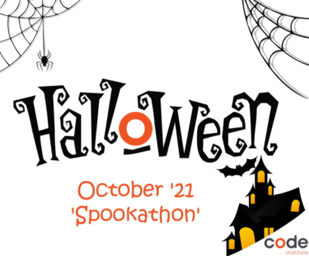
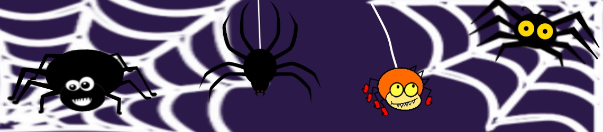
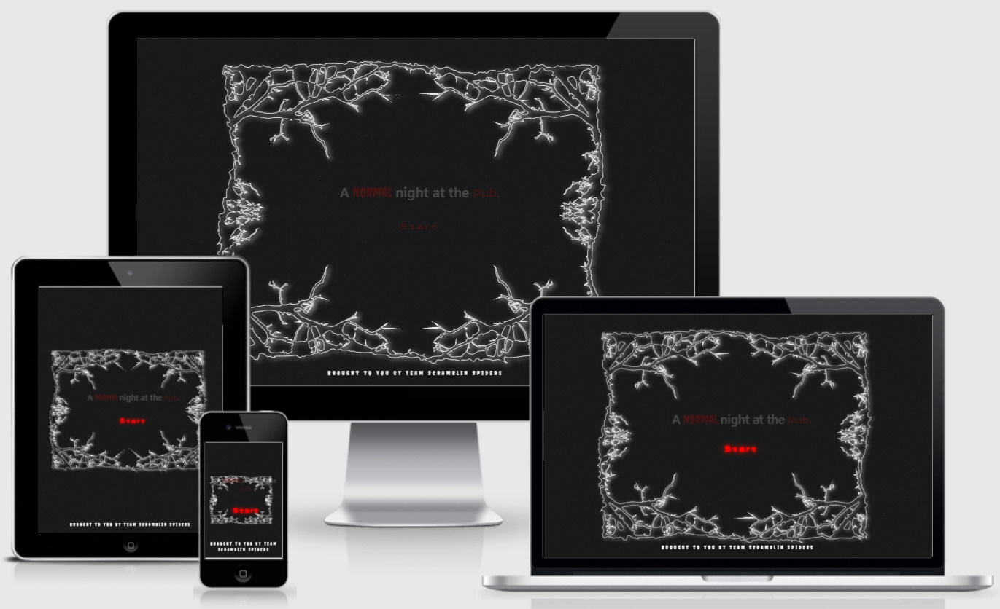
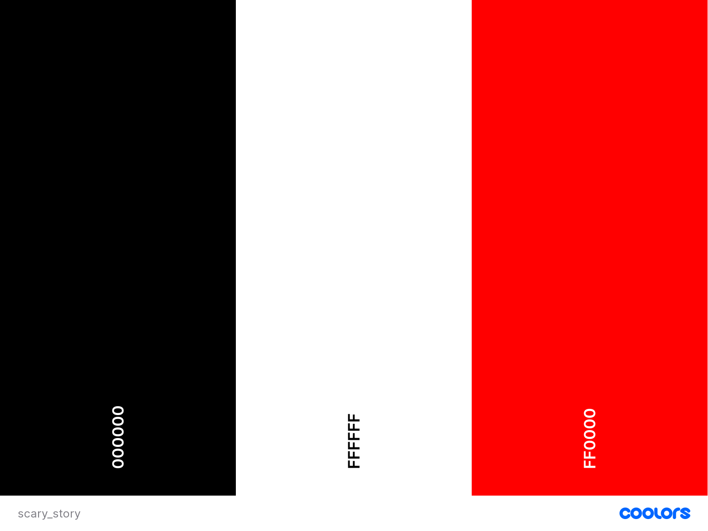

Halloween 'Spookathon' 2021
======




This Hackathon event is hosted by [Code Institute](https://www.codeinstitute.net/).

## **Team: Scramblin’ Spiders**



[VladimirM](https://github.com/Vlad-404)<br>
[Aws Sabah Gheni](https://github.com/AwsSG)<br>
[john traas_ci](https://github.com/jays-t)<br>
[Carla Buongiorno](https://github.com/CarlaBuongiorno)<br>
[Puk](https://github.com/Puksrevolution)<br>
Facilitator: [tim_ci]()

Live Project
======

## **A Normal Night at the Pub | Which path will you go down**
[View the live project here](https://awssg.github.io/scramblinspiders/)


Screenshot
======

All screenshots created using [Am I responsive](http://ami.responsivedesign.is/).



---
### **Contents** ###

- [Hackathon](#hackathon)
  - [What is a Hackathon?](#what-is-a-hackathon)
  - [Hackathon Description](#hackathon-description)
  - [Detailed Theme requirements: TBA](#detailed-theme-requirements-tba)
  - [Hackathon Goals](#hackathon-goals)
  - [Website Description](#website-description)  
- [UX Design](#ux-design)
  - [User Stories](#user-stories)
    - [Viewing and Navigation](#viewing-and-navigation)
    - [Admin and Owner Management](#admin-and-owner-management)
- [Design](#design)
  - [Colours](#colours)
  - [Wireframes](#wireframes)
  - [Mockups](#mockups)        
- [Technologies](#technologies)
  - [Languages](#languages)  
  - [Frameworks](#frameworks)
  - [Tools](#tools)
- [Features](#features)  
  - [Future Features](#future-features)
- [Deployment](#deployment)
  - [How to run the project locally](#how-to-run-the-project-locally)
    - [Forking the GitHub Repository](#forking-the-github-repository)
    - [Cloning the GitHub Repository](#cloning-the-github-repository) 
- [Credits](#credits)
  - [Images](#images)  

---
Hackathon
======

### **What is a Hackathon?** ###

A Hackathon is a sprint-like event in which teams
collaborate intensively on software projects.

The goal of a hackathon is to create a functioning
project by the end of the event.

Hackathons are a great way to get real-world
experience of agile programming and working
together in a team, just like you would in a dev role.

### **Hackathon Description** ###
You'll be assigned to a team, and work together to build a project based on an assigned theme.

You can work according to your own schedule but participants are asked to dedicate a minimum of 8-10 hours to working on the project.

All levels are welcome, from absolute beginners to advanced developers.

### **Detailed Theme requirements: TBA** ###

#### **Hackathon Theme:**
Build an interactive Halloween book or story<br>
Your sit or app should have the following element:
- Depict a halloween (or fairy tale) story
- Can be interacted with in some way
- Should have animated elements
- Be creative!!

#### **Schedule:**

***Please note: All times are in BST(Irish/UK time)***

Wed, 13th Oct @ 17:00 - 18:00 : Kick-Off Webinar

Mon, 18th Oct @ 15:00 : Project Submission Deadline

Mon, 18th Sep @ 17:00 - 18:30 : Project Presentation Webinar

Tue, 19th Oct@ 15:00: Winners announced on Slack

#### **Judging Criteria**
- The project provides a clear and substantial value to the user.
- The project uses an original or innovative idea, design or implementation.
- The project was well-planned and executed, using GitHub Projects.
- Has a well structured and completed documentation (README & Wireframes).
- The project focus is realistic, and has an overall sense of completeness.

### **Hackathon Goals** ###
- To build something awesome to be proud of
- To make effective use of course knowledge and fulfill all given requirements
- To get experience in team work, project- and time management
- To make a project with a great looking layout, that works and that is practical
- To create a web application that makes the user want to stay and use with pleasure

### **Website Description** ###

**A Normal Night at the Pub | Which path will you go down**

....

[Back to Table of contents](#table-of-contents)

---

UX DESIGN
===

### **User Stories** ###

#### **Viewing and Navigation** ####

As a **user**,<br>

1. I want to be able to switch sound on an off.
2. I want to be able to read the story.
3. I want to be able to interact with the story.
4. I want to be able to affect the storyline.
5. I want to be able to affect the story outcome.
6. I want to be scared from time to time.
7. I want to experience more than just reading a story.
8. I want audio as well as visual elements to enhance my experience.
9. I want to be able to read the story again.

#### **Admin and Owner Management** ###

As a **Page owner**,

1. I want to be able to update stories and add new content.
2. I want to be able to reuse modules and functions for future content updates. 

[Back to contents](#contents)

---

Design
===

### **Colours** ###



- *Background* (#000000) - Black
- *Text* (#FFFFFF) - White
- *Buttons* (#FF0000) - Red

### **Wireframes** ###

- [Story Outline](./static/assets/wireframes/story_outline_v2.pdf)
- [Story Wireframe](./static/assets/wireframes/story_wireframe_v2.pdf)

### **Mockups** ###
- [Story Intro](./static/assets/images/mockups/story_intro.jpg)
- [Story Part 1](./static/assets/images/mockups/story_part_1.jpg)
- [Story Part 2.1](./static/assets/images/mockups/story_part_2.1.jpg)
- [Story Part 2.2](./static/assets/images/mockups/story_part_2.2.jpg)
- [Story Part 2.3](./static/assets/images/mockups/story_part_2.3_death.jpg)
- [Story Part 3.1](./static/assets/images/mockups/story_part_3.1.jpg)
- [Story Part 3.2](./static/assets/images/mockups/story_part_3.2.jpg)
- [Story Part 3.3](./static/assets/images/mockups/story_part_3.3.jpg)
- [Story Part 3.4](./static/assets/images/mockups/story_part_3.4_death.jpg)
- [Story Part 4.1](./static/assets/images/mockups/story_part_4.1.jpg)
- [Story Part 4.2](./static/assets/images/mockups/story_part_4.2.jpg)
- [Story Part 4.3](./static/assets/images/mockups/story_part_4.3.jpg)
- [Story Part 4.4](./static/assets/images/mockups/story_part_4.4_death.jpg)
- [Story Part 5.1](./static/assets/images/mockups/story_part_5.1.jpg)
- [Story Part 5.2](./static/assets/images/mockups/story_part_5.2.jpg)
- [Story Part 5.3](./static/assets/images/mockups/story_part_5.3.jpg)
- [Story Part 5.4](./static/assets/images/mockups/story_part_5.4.jpg)

[Back to contents](#contents)

---

Technologies
===

### **Languages** ###

- [HTML5](https://developer.mozilla.org/en-US/docs/Web/HTML)
  - Used as the main markup language for the website content.
- [CSS3](https://developer.mozilla.org/en-US/docs/Web/CSS)
  - Used to style the individual webpages.
- [JavaScript](https://developer.mozilla.org/en-US/docs/Web/JavaScript)
  - Used to create the interactive functionality of the website

### **Frameworks** ###

- [Bootstrap5](https://getbootstrap.com/)
  - Used to design a mobile-first responsive website layout.

### **Tools** ###

- [Git](https://git-scm.com/)
  - Git was used for version control by utilizing the Gitpod terminal to commit to Git and push to GitHub.
- [GitHub](https://github.com/)
  - Used to store, host and deploy the project files and source code after being pushed from Git.
- [Gitpod](https://www.gitpod.io/)
  - An online IDE linked to the GitHub repository used for the majority of the code development.
- [GitHub Pages](https://pages.github.com/)
  - It used to deploy the project.
- [Google fonts](https://fonts.google.com/)
  - Used for the website fonts.
- [Balsamiq wireframes](https://balsamiq.com/)
  - An online tool to designed the site mock-ups.
- [Coolors](https://coolors.co/)
  - An online tool used to create the website colour scheme.
- [paint.net](https://www.getpaint.net/roadmap.html)
  - Used to create the Mockups and to edit images.
- [favicon.io](https://favicon.io/)
  - Used to create the website favicons
- [Am I Responsive?](http://ami.responsivedesign.is/)
  - A tool for taking a quick snapshot of the responsive breakpoints of the website to visualize how the site will look on different device screen sizes in one place. The resulting screenshot is also used as the README.md logo image.

[Back to contents](#contents)

---

Features
===

### **Future Features** ###

- A set of friendly HTTP Error landing pages for site visitors to see if a requested page is unavailable or cannot be accessed.
  - The pages provide a message to the user and a button to click to return the visitor to the homepage.
  - HTTP 404, 500 & 503 errors are handled with custom templates to cover the most common events.
- An audio storyteller

[Back to contents](#contents)

---

Deployment
===

## **How to run the project locally**

You can either fork or clone the GitHub repository to use this project.

### **Forking the GitHub Repository**
Log in to GitHub and locate the GitHub account [AwsSG](https://github.com/AwsSG) to get the 
[scramblinspiders](https://github.com/AwsSG/scramblinspiders) repository.

Make a copy of the GitHub Repository by "forking" the orginal repository onto your own account, where changes can be made without affecting original repository.

Click on the fork icon (located on top right of the page at the same level of repository name)
You should now have a copy of this repository into your GitHub account.

For more information on how to clone a repository, please check this [GitHub documentation](https://docs.github.com/en/github/getting-started-with-github/fork-a-repo).

### **Cloning the GitHub Repository**
Log in to GitHub and locate the GitHub account [AwsSG](https://github.com/AwsSG) to get the 
[scramblinspiders](https://github.com/AwsSG/scramblinspiders) repository.

- Under the repository name, click the **Code** button.
  - **Copy** the url in the dropdown box.
  - Using your favourite **IDE** open up your preferred terminal.
  - **Navigate** to your desired file location.
​​
```
gh repo clone AwsSG/scramblinspiders
```
    
You can find all the steps to follow according your chosen method in this [GitHub documentation](https://docs.github.com/en/github/creating-cloning-and-archiving-repositories/cloning-a-repository) on how to clone a reposistory.

[Back to contents](#contents)

---

Credits
===

### **Images** ###

- **Images**
  - [pixabay](https://pixabay.com/)
  - [unsplash](https://unsplash.com/)

- **Icons**  
  - [The Noun Project](https://thenounproject.com/)  
  - [Icon finder](https://www.iconfinder.com/)  
  - [flaticon](https://www.flaticon.com/)
  
- **Favicon**
  - [iconfinder](https://www.iconfinder.com/)

